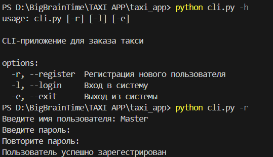

<a id="anchor"></a>
# CLI-приложение для службы такси 
***

[Ссылка на доску Miro с архитектурой проекта.](https://miro.com/app/board/uXjVKMZ3lDQ=/)

***
>
## Описание проекта.
Данное приложение служит для заказа такси.
При помощи него можно зарегестрироваться или войти в локальную базу данных, создать заказ или посмотреть их историю.
Работа с приложением реализовывается через командную строку.

***

## Инструкции по работе с приложением.
Основная работа с приложеним происходит через [cli.py](cli.py)

Запуск приложения
: Запустить прилодение можно через команду ```python cli.pi -[ключ]```
    - Ключ __-h (--help)__ показывает все возможные ключи 
    - Ключ __-r (--register)__ позволяет зарегестрировать нового
    пользователя, после чего завершает выполнение приложения
    - Ключ __-l (--login)__ позволяет пользователю войти в систему
    - Ключ __-e (--exit)__ завершает работу приложения

При регистрации Вас попросит ввести ваше имя и пароль. Ввод пароля скрыт от глаз пользователя.
Когда пользователь смог войти в систему, перед ним появится меню с дальнейшим выбором действия:
- Создание заказа такси (ввод точки отправления и точки прибытия)
- Просмотр вашей истории заказов (появится список поездок, где в каждой указано место отправления, прибытия и время, в которое было заказано такси)
- Завершение работы приложения
***

[Вверх](#anchor)
